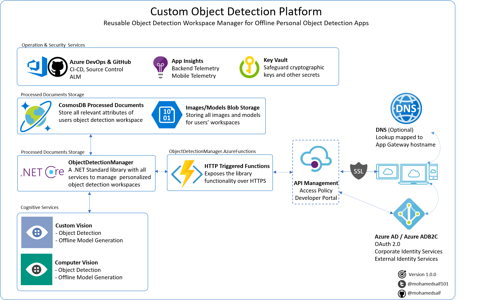

# Vision Object Detector Platform

I worked in a project where we needed to create personal object detection platform that supports exporting custom trained models to run in an offline mode on mobile devices (iOS (CoreML), Android (TensorFlow) and Windows (ONNX)).

## Implementation

This project objective is to create a platform that will allow developers to offer personalized offline object detection models to be as part of a mobile app.

In order to successfully deploy this platform, you need to provision the following services on Azure:

1.  **Cosmos DB**: used in storing the user object detection workspace, which includes training files with regions and information about the workspace
2.  **Azure Storage**: used in storing the uploaded training images and the exported models for the 3 platforms in a container for each user
3.  **Custom Vision Service**: used in providing the object detection training backend
4.  **API Management Service**: used to securely expose the Azure Functions to the Internet through subscription based access with call rate limitation policy in place
5.  **Application Insights**: used to collect performance and health telemetry for the Azure Functions
6.  **OPTIONAL Computer Vision Service**: used in providing access to Microsoft Computer Vision pretrained service to detect objects without any custom training

Vision Object Detector project include 3 components to achieve that:

1.  **ObjectDetectionManager**: a .NET Standard Library that offers all needed services to orchestrate workspace creation, custom vision training and other management services needed.
2.  **ObjectDetectionManager.AzureFunctions**: exposes several Azure Functions of the ObjectDetectionManager library to provide HTTP access to the service beyond C#
3.  **ObjectDetectionManager.TestClient**: a simple console application with demo images and data to show how the ObjectDetectionManager library is used in a client application. Demo data is used from [Azure Cognitive Services Sample on Github](https://github.com/Azure-Samples/cognitive-services-dotnet-sdk-samples)

## Roadmap

Currently I'm working to:
1.  Complete the Azure Functions implementation and testing :)
2.  Complete other workspace management features (like extract workspace and delete workspace) to offer GDPR compiant system.
3.  Create asynchronous scenario using Durable Azure Functions and storage queues
4.  Provide better error handling especially when it relates to failures in submission to Custom Vision service
5.  Create a ClientSDK to the Azure Function to .NET apps can access the HTTP functions without writing HTTP calls
6.  Create a sample Xamarin Forms mobile client

## About the project

I tried to make sure I cover all aspects and best practices while building this project, but all included architecture, code, documentation and any other artifact represent my personal opinion only. Think of it as a suggestion of how a one way things can work.

Keep in mind that this is a work-in-progress, I will continue to contribute to it when I can.

All constructive feedback is welcomed :)

## Support

You can always create issue, suggest an update through PR or direct message me on [Twitter](https://twitter.com/mohamedsaif101).

## Authors

|                  |
|:----------------------------------------------:|
|                 **Mohamed Saif**               |
|     [GitHub](https://github.com/mohamedsaif)   |
|  [Twitter](https://twitter.com/mohamedsaif101) |
|         [Blog](http://blog.mohamedsaif.com)    |